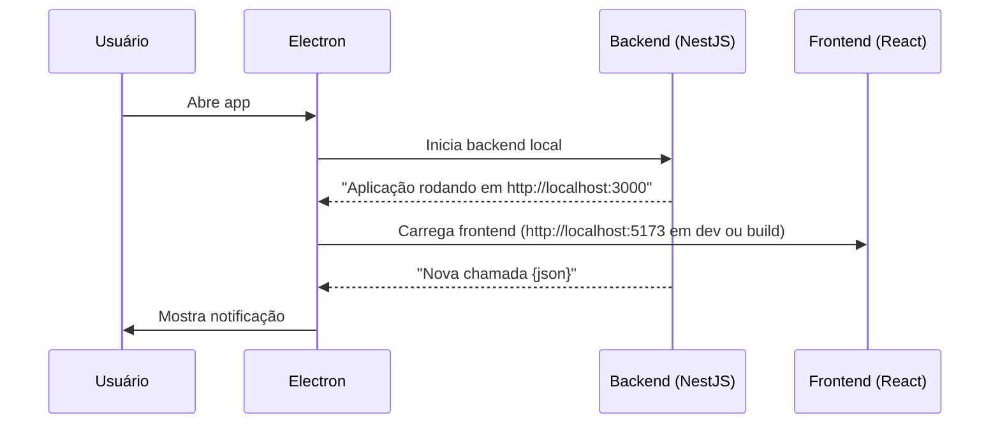

# 🖥️ EAATA Help Desk - Versão Local

Este projeto é um aplicativo desktop baseado em **Electron + React (Vite) + NestJS**, que roda tanto o frontend quanto o backend de forma integrada.  

Ele é voltado para **gerenciamento de chamados internos** com **notificações em tempo real**.

---


## 📑 Sumário

- [🚀 Funcionalidades](#-funcionalidades)
- [🏗️ Estrutura do Projeto](#️-estrutura-do-projeto)
- [🔧 Como funciona](#-como-funciona)
- [⚠️ Ajuste necessário para evitar erro com `fontkit`](#-ajuste-necessário-para-evitar-erro-com-fontkit)
- [🖥️ Desenvolvimento (manual)](#️-desenvolvimento-manual)
- [🖥️ Desenvolvimento (automático)](#️-desenvolvimento-automático)
- [🏗️ Produção (manual)](#️-produção-manual)
- [🏗️ Produção (automático)](#️-produção-automático)
- [🔔 Notificações](#-notificações)
- [🖱️ Tray (Bandeja do sistema)](#️-tray-bandeja-do-sistema)
- [✅ Tecnologias](#-tecnologias)
- [📦 Como empacotar](#-como-empacotar)
- [🤔 Fluxo resumido](#-fluxo-resumido)
- [⚠️ IMPORTANTE](#️-importante)
- [🆕 Atualizações futuras](#-atualizacao)
---


## 🚀 Funcionalidades

✅ **Frontend (React + Vite)** embutido no Electron  
✅ **Backend (NestJS)** iniciado automaticamente pelo Electron  
✅ **Splash Screen** enquanto o backend carrega  
✅ **Tray (bandeja do sistema)** para manter o app minimizado  
✅ **Reiniciar backend** diretamente pelo tray  
✅ Suporte para **build de produção** (com `backend.exe` e frontend compilado)

---


## 🏗️ Estrutura do Projeto

/electron → Código principal do Electron

/frontend → React + Vite

/backend → NestJS

/assets → Ícones, imagens e splash screen

---


## 🔧 Como funciona

1. Quando o usuário abre o aplicativo:
  - **Splash screen** aparece
  - Electron **inicia o backend**:
    - Em **dev**: executa `node ../backend/dist/main.js`
    - Em **prod**: executa `backend.exe` empacotado
2. Quando o backend imprime `Aplicação rodando em ...`, o Electron:
  - Fecha a splash screen
  - Abre a janela principal (frontend)
3. O backend envia notificações via **console log** (`Nova chamada {json}`)
4. O Electron escuta essas mensagens e exibe **notificações do sistema**

---


## ⚠️ Ajuste necessário para evitar erro com `fontkit`

No arquivo `nodue_modules/fontkit/dist/main.cjs`, altere:

```js
new TextDecoder('ascii');
```
Para:

```js
new TextDecoder('utf-8');
```

---


## 🖥️ Desenvolvimento (manual)

### 1️⃣ Backend

```bash
cd backend
npm install
npm run build
```
Isso gera o `dist/main.js` usado pelo Electron em modo dev.

### 2️⃣ Frontend

```bash
cd frontend
npm install
npm run dev
```
Roda o React localmente em `http://localhost:5173` durante desenvolvimento.

### 3️⃣ Electron

```bash
cd electron
npm install
npm start
```
Isso vai:

- Mostrar o splash screen
- Rodar `../backend/dist/main.js` em dev
- Quando o backend estiver pronto, abre `http://localhost:5173`

---


## 🖥️ Desenvolvimento (automático)

```bash
cd electron
npm run install:all
npm run dev
```
Este comando:
- Faz download de todas as dependências
- Inicia o backend automaticamente
- Abre o Electron
- Carrega o frontend em modo dev

---


## 🏗️ Produção (manual)

### 1️⃣ Gerar build do backend

```bash
cd backend
npm run build
```
Opcional: empacote o backend em um executável (`backend.exe`) usando `pkg`.

### 2️⃣ Gerar build do frontend

```bash
cd frontend
npm run build
```
Isso gera `dist/` com os arquivos estáticos.

### 3️⃣ Empacotar Electron
Copie os builds para dentro do `electron/builds`:

```bash
electron/builds/frontend/    → arquivos do React buildados  
electron/builds/backend/     → backend.exe empacotado  
```

---


## 🏗️ Produção (automático)
Gerar todos os builds + instalador

```bash
cd electron
npm run install:all
npm run package
```
Isso executa:
- Instala dependências
  - `install:electron` → do electron
  - `install:backend` → do backend
  - `install:frontend` → do frontend
- Executa os builds
  - `build:backend` → gera `backend.exe`
  - `build:frontend` → gera `dist/`
- `copy:all` → copia para `electron/builds`
- `electron-builder` → gera instalador

---


## 🔔 Notificações
Quando um novo chamado é criado, o backend loga no console:

```json
Nova chamada {
  "department": "Financeiro",
  "title": "Teste",
  "description": "",
  "status": "open"
}
```
O Electron detecta essa mensagem e exibe uma notificação do sistema com título e departamento.

---


## 🖱️ Tray (Bandeja do sistema)
Quando o app está rodando, ele fica na bandeja do sistema.

- Clique ESQUERDO → Abre a janela principal
- Clique DIREITO → Mostra menu com opções:
  - Abrir → Mostra janela
  - Reiniciar Backend → Mata e reinicia o backend local
  - Reiniciar Aplicativo → Fecha e reabre o app
  - Fechar Aplicação → Sai completamente

---


## ✅ Tecnologias
Electron → Shell desktop
NestJS → Backend
React (Vite) → Frontend
Socket.IO → Notificações em tempo real
Node.js child_process.spawn → Controle do backend

---


## 📦 Como empacotar
Para gerar um instalador:

```bash
cd electron
npm run dist
```
Isso vai criar o instalador para Windows na pasta `dist/`.

---


## 🤔 Fluxo resumido


---


## ⚠️ IMPORTANTE
Esta versão NÃO suporta backend externo.

Sempre roda o backend localmente.

## 🆕 Atualizações futuras

|  Feito   | Atualizações                                                |
|----------|-------------------------------------------------------------|
| &#x2610; | Aceitar backend externo                                     |
| &#x2610; | Modificar departamentos através do configs                  |
| &#x2610; | Separar abas no configs para configurações de front e back  |
| &#x2610; | Ligar/desligar notificações para computadores específicos   |